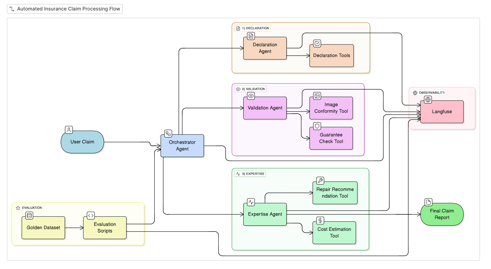

# 🏠 AssurHabitat Agents

**AssurHabitat Agents** is an AI-driven multi-agent system designed to automate and support **home insurance claim processing**.  
The project combines **LLMs, Computer Vision, multi-agent orchestration, LangGraph, and Langfuse** to cover the full lifecycle of an insurance claim — from initial declaration to validation, expertise, cost estimation, and evaluation.

---

## Key Features

- **Declaration Agent**  
  Extracts structured information from user claim declarations (text + images).
- **Validation Agent**  
  Verifies image conformity and factual consistency with the declared claim.
- **Expertise Agent**  
  Performs expert reasoning, business logic validation, and tool-based analysis.
- **Orchestration Agent**  
  Manages the end-to-end workflow and selects the most appropriate service provider.
- **Observability & Tracing**  
  Full tracing of tool calls, decisions, and errors using **Langfuse**.
- **Agent Evaluation Framework**  
  Golden Dataset–based evaluation with automated metrics.

---

## System Architecture


---

## Project Goals

- Automate complex insurance claim workflows  
- Ensure AI decisions are explainable and traceable  
- Enable fast iteration on prompts, tools, and agents  
- Follow modern LLMOps / AgentOps best practices  

---

## Technical Stack & Design Choices

- **LangGraph** — multi-agent orchestration and state machines  
- **Langfuse** — observability, datasets, and evaluation  
- **HuggingFace** — LLMs and Vision-Language Models  
- **Python 3.11**  
- **Tool-based, agentic architecture**

---

### Install dependencies

```bash
pip install -r requirements.txt
```

Create .env file with variables HF_TOKEN, LANGFUSE_SECRET_KEY, LANGFUSE_PUBLIC_KEY, LANGFUSE_BASE_URL then
```bash
make setup
```

Run the projet
```bash
make run
```

---

## Observability with Langfuse

The project relies on Langfuse for:
- Tracing every LLM and VLM call
- Tracking tool usage and agent decisions
- Debugging failures and unexpected behaviors
- Running dataset-based evaluations

Centralized configuration is located in: src/assurhabitat_agents/config/langfuse_config.py

The @observe() decorator is used across agents and tools to enable automatic tracing.

---
## Agent Evaluation

### Golden Dataset

The `eval/golden_dataset.json` file contains **9 reference scenarios** (3 per claim family), each including:

- User input (text + images)
- Expected outputs for each agent
- Business-grounded reference decisions

Claim families covered:
- 🔥 Fire / Explosion
- 💧 Water Damage
- 🔓 Theft / Vandalism

---

### 📊 Evaluation Metrics

| Agent | Metric |
|------|-------|
| Declaration Agent | Information completeness |
| Validation Agent | Image–claim consistency |
| Expertise Agent | Manual expert review |

---

### ▶️ Run the Evaluation

Run the full evaluation pipeline on the golden dataset:

```bash
cd src/
python ../eval/run_golden_evaluation.py
```

---

## Roadmap (Ideas)

- Improved automatic scoring metrics  
- Domain-specific fine-tuning, particularly for expertise and cost estimation
- PDF claim report generation  

---

## 👤 Author

Developed by **Remi Nollet** — AI, Computer Vision, LLM & Agentic Systems engineer

---

## License

Educational and demonstrator project  
Free to use for learning, experimentation, and demos.
